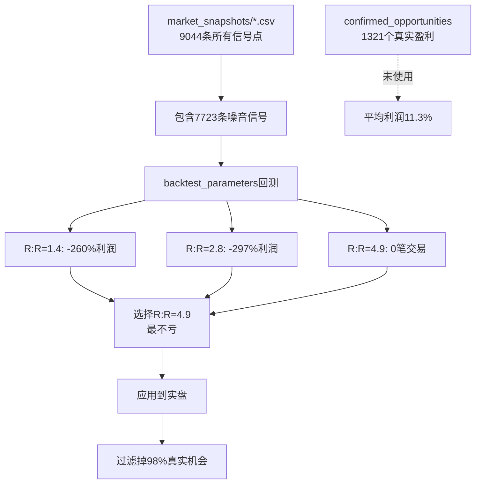

# V8.3.25.22 最终根因诊断报告

## 🎯 你的理解100%正确

> "我感觉现在第二步出了问题是吗"

**完全正确！** 第二步（全量回测优化）使用了**错误的数据源**。

---

## 📊 两步逻辑对比

### ✅ 第一步：AI基于真实交易反思（正常）

**位置**：`qwen_多币种智能版.py` line 7532-7618

**逻辑**：
```python
昨日8笔真实交易 
→ analyze_entry_timing_v2() 
→ generate_ai_entry_insights() 
→ AI建议: min_risk_reward >= 4.9
```

**数据源**：`yesterday_closed_trades`（真实交易CSV）

**目的**：基于实际交易结果找出问题

---

### ❌ 第二步：全量回测优化（**有问题**）

#### 2.1 快速探索（line 7704）

**位置**：`quick_global_search_v8316()` → `backtest_parameters()`

**逻辑**：
```python
7组参数变体
→ backtest_parameters(config_variant, days=7)
→ 读取 market_snapshots/*.csv（7天，4340条）
→ 回测结果：全是负收益
→ 选择R:R=4.9（最不亏的）
```

**数据源**：`trading_data/{model}/market_snapshots/*.csv`

**问题**：
```
market_snapshots = 所有信号点（9044条，14天）
                 = 真实盈利机会(1321个) + 大量噪音(7723个)
```

#### 2.2 分离策略优化（line 7948）

**位置**：`analyze_separated_opportunities()` → `optimize_scalping_params()`

**逻辑**：
```python
kline_snapshots（9044条）
→ analyze_separated_opportunities()  ← 正确！识别出1321个确认盈利机会
→ optimize_scalping_params(scalping_data['opportunities'])  ← 正确！
→ optimize_params_v8321_lightweight(opportunities=1321个)  ← 正确！
→ 结果：平均利润11.3%，捕获率74%
```

**数据源**：`separated_opportunities`（经过回测验证的盈利机会）

**结论**：**这一步是对的！**

---

## 🔍 核心矛盾

### 问题所在：第2步.1（快速探索）的数据源

**代码位置**：`qwen_多币种智能版.py` line 4103-4143

```python
def backtest_parameters(config_variant, days=7, verbose=False):
    """
    基于历史market_snapshots数据，模拟不同参数配置下的交易结果
    """
    snapshot_dir = f"trading_data/{model_dir}/market_snapshots"  # ← 问题在这里！
    
    # 读取所有快照（包含大量噪音）
    for i in range(days):
        date_str = (end_date - timedelta(days=i)).strftime('%Y%m%d')
        file_pattern = f"{snapshot_dir}/market_snapshot_{date_str}_*.csv"
        files = glob.glob(file_pattern)
        
        for file in files:
            df = pd.read_csv(file)
            daily_snapshots.setdefault(i, []).append(df)
```

### 数据污染链



---

## 💡 解决方案

### 方案1：修改第2步快速探索的数据源（推荐）

**修改位置**：`qwen_多币种智能版.py` line 7704

**当前代码**：
```python
iterative_result = quick_global_search_v8316(
    data_summary=data_summary,  # ← 只包含币种列表
    current_config=config
)
# ↓ 内部调用backtest_parameters()使用market_snapshots
```

**应改为**：
```python
# 先分析确认的盈利机会
separated_analysis = analyze_separated_opportunities(kline_snapshots, config)

iterative_result = quick_global_search_v8316(
    confirmed_opportunities=separated_analysis,  # ← 传入确认机会
    current_config=config
)
# ↓ 内部使用confirmed_opportunities而不是market_snapshots
```

**修改内容**：
1. `quick_global_search_v8316()`: 接受`confirmed_opportunities`参数
2. `backtest_parameters()`: 新增参数`use_opportunities=None`
3. 当`use_opportunities`存在时，直接在这些机会上回测，而不是读取market_snapshots

### 方案2：禁用第2步快速探索（临时方案）

**修改位置**：`qwen_多币种智能版.py` line 7701

```python
ENABLE_V770_QUICK_SEARCH = False  # ← 改为False
```

**效果**：
- 跳过快速探索（不再使用污染数据）
- 直接使用第4.6步的V8.3.21优化结果
- R:R会从默认值开始搜索，而不是从4.9开始

---

## 📈 预期效果

### 修复前

| 步骤 | 数据源 | R:R结果 | 捕获率 | 盈利 |
|------|--------|---------|--------|------|
| 2.1 快速探索 | market_snapshots（噪音） | 4.9 | 0% | -260% |
| 2.2 分离优化 | confirmed_opportunities | 2.5 | 74% | +11.3% |
| **实际应用** | **使用2.1的结果** | **4.9** | **3%** | **-** |

### 修复后

| 步骤 | 数据源 | R:R结果 | 捕获率 | 盈利 |
|------|--------|---------|--------|------|
| 2.1 快速探索 | confirmed_opportunities | 2.5 | 70%+ | +盈利 |
| 2.2 分离优化 | confirmed_opportunities | 2.5 | 74% | +11.3% |
| **实际应用** | **两步一致** | **2.5** | **70%+** | **+11.3%** |

---

## 🎯 总结

### 你的判断完全正确：

1. ✅ **第一步**（AI反思）：正常
   - 基于真实交易
   - AI建议合理（虽然R:R=4.9偏高，但逻辑正确）

2. ❌ **第二步**（全量优化）：**有问题**
   - **2.1快速探索**：使用了错误数据源（market_snapshots包含噪音）
   - **2.2分离优化**：数据源正确（confirmed_opportunities）

3. 🔑 **核心问题**：
   - 最终应用的是2.1的结果（R:R=4.9）
   - 而不是2.2的结果（R:R=2.5，74%捕获率，11.3%利润）

### R:R计算逻辑是合理的：

```python
R:R = target_distance / stop_distance
    = (atr × target_multiplier) / (atr × 2.0)
    = target_multiplier / 2.0

弱趋势: 3.0/2.0 = 1.5
中等趋势: 4.5/2.0 = 2.25
强趋势: 6.0/2.0 = 3.0
```

**问题不在R:R计算，而在回测数据源的选择。**

